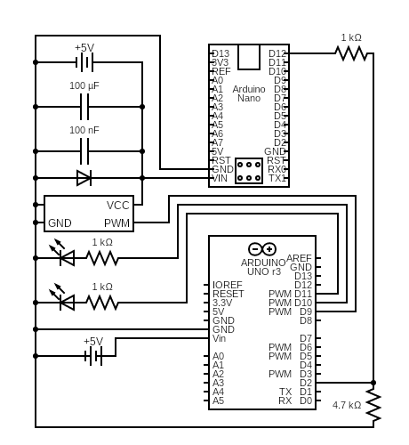

# miso-gomay
Automated pet bowl lid BLE detection and actuation.

NOTE: the code assumes you use PWM pin D12 on the Nano as the signal output along with digital pin 2 on the Uno as signal input and PWM pin 9 as servo signal output.

